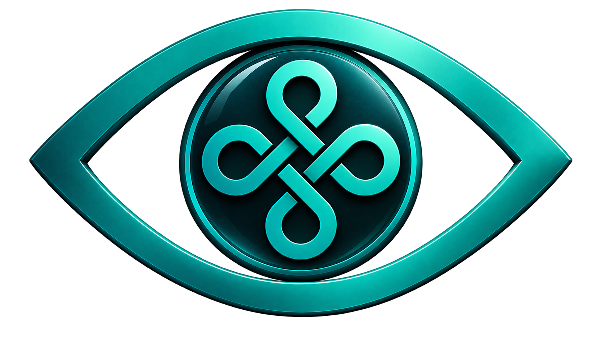

<div align="center">



# 👁️ OpusScreen

**Luminosité 5 % → 150 %, température de couleur, daltonisme et basse vision.**

**Pour Windows** — et désormais **[pour macOS](mac/)**, portage intégral, fonction par fonction.

Né de l’analyse des **API Windows** employées par **PangoBright** et **f.lux** — en-têtes,
table d’import, chaînes de caractères ; aucun désassemblage, aucune copie de code — puis
étendu avec les fonctions que les concurrents facturent, et avec d’autres qu’ils n’ont pas.

**Site : [antoinebonpro.github.io/OpusScreen](https://antoinebonpro.github.io/OpusScreen/)**

</div>

```
5 %                    100 %                    150 %
 |──────────────────────|────────────────────────|
 └── voile logiciel     └── état normal          └── rétroéclairage physique
     (PangoBright)          (rien n'est modifié)      + courbe gamma + gain
                                                      (territoire inédit)
```

---

## 🎯 Pourquoi

PangoBright ne dépasse jamais 100 % — et pour une raison structurelle : il pose un **voile
noir semi-transparent** par-dessus l'écran. Un voile retire de la lumière, il n'en ajoute pas.

f.lux, lui, reprogramme la **table de couleurs de la carte graphique**, ce qui permet de
dépasser 100 % — mais il ne s'en sert que pour la température, jamais pour la luminosité.

OpusScreen réunit les deux techniques, y ajoute le **rétroéclairage physique** et une
**matrice de couleur plein écran**, et pilote le tout depuis une seule interface.

## ⚖️ Ce qu'il fait

| | PangoBright | f.lux | Iris Pro 15 $ | Lunar Pro 23 $ | **OpusScreen** |
|---|:--:|:--:|:--:|:--:|:--:|
| 🔆 Luminosité logicielle | 20-100 % | — | oui | oui | **5-150 %** |
| 🚀 Au-delà de 100 % | — | — | — | payant | **oui** |
| 💡 Rétroéclairage physique | — | — | — | oui | **oui** |
| 🌡️ Température de couleur | — | oui | oui | — | **oui** |
| 🌅 Suivi solaire | — | oui | oui | oui | **oui, hors ligne** |
| 🎬 Adaptation au contenu | — | — | — | — | **oui** |
| 🗂️ Profils par application | — | — | — | payant | **oui** |
| 🖥️ Réglages par écran | exclusion | — | payant | oui | **oui** |
| ⏰ Pauses 20-20-20 | — | — | payant | — | **oui** |
| ⌨️ Ligne de commande | — | — | — | payant | **oui** |
| 💰 Prix | gratuit | gratuit | 15 $ | 23 $ | **gratuit** |

Et sur le terrain de l'accessibilité, où le tableau devient vite court :

| | PangoBright | f.lux | Iris Pro | Lunar Pro | **OpusScreen** |
|---|:--:|:--:|:--:|:--:|:--:|
| 🎨 Filtres daltonisme | — | — | — | — | **3 types** |
| 📊 Gravité réglable (anomalies) | — | — | — | — | **0 à 100 %** |
| 🔬 Simulation pour concepteurs | — | — | — | — | **oui** |
| ✅ Vérification chiffrée du réglage | — | — | — | — | **oui** |
| 🏷️ Identificateur de couleur | — | — | — | — | **oui** |
| 🔍 Loupe plein écran | — | — | — | — | **oui** |
| 🎯 Anneau de repérage du pointeur | — | — | — | — | **oui** |
| 🌗 Inversion à teintes conservées | — | — | inversion simple | — | **oui** |
| 👀 Rappel de clignement | — | — | — | — | **oui** |
| 🔊 Compatible lecteurs d'écran | — | — | — | — | **oui** |

Plus de **85 réglages** répartis sur 11 pages, dont un onglet dédié au daltonisme, 20 modes livrés, 15 raccourcis globaux
reconfigurables.

## 🌐 Site

Présentation, démonstration interactive du daltonisme et captures d’écran :
**[antoinebonpro.github.io/OpusScreen](https://antoinebonpro.github.io/OpusScreen/)**

Les sources du site vivent dans [site/](site/) et les captures se régénèrent d’une
commande : `tests\run-tests.cmd captures`.

## ⬇️ Télécharger

**[OpusScreen.exe — dernière version](https://github.com/antoinebonpro/OpusScreen/releases/latest/download/OpusScreen.exe)**

Un seul fichier, qui s'appuie sur le .NET Framework 4, présent sur toute installation
de Windows depuis Windows 7. Double-cliquez-le, où que le navigateur l'ait posé.

> 📦 **Il se range tout seul.** Au premier lancement, OpusScreen se copie dans
> `%LOCALAPPDATA%\Programs\OpusScreen\`, sans droits administrateur, crée son raccourci
> dans le menu Démarrer et s'inscrit dans *Applications installées*, d'où il se
> désinstalle. Le fichier téléchargé peut ensuite être supprimé.
>
> Une seule copie tourne, et c'est la plus récente : une version plus récente lancée
> depuis n'importe où ferme l'ancienne et prend sa place ; une version plus ancienne,
> oubliée dans Téléchargements, s'efface devant celle qui est installée.

> 🔄 **Mises à jour.** Une fois par jour, OpusScreen demande à GitHub le numéro de la
> dernière version publiée — c'est sa seule connexion, et rien d'autre n'est envoyé.
> Quand une version plus récente existe, il la propose ; rien ne s'installe sans votre
> accord. Le fichier téléchargé est vérifié (taille, empreinte SHA-256 publiée par
> GitHub, numéro de version) avant de remplacer l'ancien. La vérification se coupe
> dans l'onglet **Avancé**.

> 🛡️ **Windows affichera un avertissement au premier lancement.** Le binaire n'est pas
> signé par un certificat commercial — ceux-ci se louent quelques centaines d'euros par
> an. SmartScreen dira « Windows a protégé votre ordinateur » : *Informations
> complémentaires* → *Exécuter quand même*. Si vous préférez ne pas faire confiance à un
> binaire, la section suivante compile le vôtre en une commande.

> 👁️ **Une fois lancée, l'application n'a pas de fenêtre permanente** : elle se range
> dans la zone de notification, en bas à droite. Son icône est un œil dont la pupille
> prend la couleur que votre écran rend à cet instant. Windows 11 replie les icônes
> récentes derrière le chevron `^` — l'onglet **Découvrir**, ouvert au premier
> lancement, explique comment l'en sortir et l'épingler.

Version 3.4.0 précisément : [OpusScreen.exe 3.4.0](https://github.com/antoinebonpro/OpusScreen/releases/download/v3.4.0/OpusScreen.exe)
· [notes de version](https://github.com/antoinebonpro/OpusScreen/releases/tag/v3.4.0).
Toutes les versions : [page des publications](https://github.com/antoinebonpro/OpusScreen/releases).

### 🍎 Pour macOS

**[OpusScreen-1.0.0.dmg — version 1.0.0](https://github.com/antoinebonpro/OpusScreen/releases/download/mac-v1.0.0/OpusScreen-1.0.0.dmg)**
· [notes de version](https://github.com/antoinebonpro/OpusScreen/releases/tag/mac-v1.0.0)
· [le code et sa documentation](mac/)

macOS 13 (Ventura) ou plus récent, Apple Silicon comme Intel. Ouvrez l'image, glissez
**OpusScreen** dans *Applications* — la fenêtre montre le geste —, puis ouvrez-le. Le portage refait **toutes** les fonctions de
la version Windows sur les API de macOS — les quatre étages de luminosité, les onze pages de
réglages, le test de daltonisme, la loupe, les quinze raccourcis, la ligne de commande — et
le fichier de configuration reste **le même**, clef par clef : une configuration exportée
depuis un PC s'importe sur le Mac telle quelle.

> 🛡️ **macOS dira « impossible de vérifier le développeur » au premier lancement**, pour la
> même raison que SmartScreen côté Windows : le paquet n'est pas signé par un certificat
> Apple, qui se loue quatre-vingt-dix-neuf euros par an. **Clic droit sur l'application →
> Ouvrir**, puis *Ouvrir* dans la boîte qui suit. Une seule fois.

> 🎥 **Deux autorisations, demandées quand elles servent.** *Enregistrement de l'écran* pour
> la saturation, les filtres de daltonisme et la loupe — sans elle, la luminosité et la
> température fonctionnent quand même, et l'application le dit. *Accessibilité* pour le fil
> de secours, qui répond au raccourci `⌃⌥⇧R` même si l'interface est bloquée.

> 📦 **Une archive `OpusScreen-mac.zip` est publiée à côté de l'image.** Elle contient
> exactement la même application : c'est elle que le Mac va chercher quand il se met à jour
> tout seul, parce qu'une image disque ne se déballe pas sans être montée. Pour installer à
> la main, prenez le `.dmg`.

Les deux versions avancent chacune à son rythme : les publications macOS portent l'étiquette
`mac-v…`, celles de Windows `v…`.

## 🔨 Compiler soi-même

Aucune dépendance à installer, aucun kit de développement : le compilateur C# utilisé
est celui que Windows livre avec le .NET Framework.

```
build.cmd            compile OpusScreen.exe
OpusScreen.exe       lance l'application (icône dans la zone de notification)
```

**Prérequis** : Windows 7 ou plus récent. Certaines fonctions demandent davantage —
voir [docs/ARCHITECTURE.md](docs/ARCHITECTURE.md#compatibilité).

Sur macOS, c'est la même promesse avec d'autres outils — et **sans Xcode** : les outils en
ligne de commande d'Apple suffisent.

```
cd mac
./build.sh            compile OpusScreen.app
./run-tests.sh all    vérifie : calcul, matériel réel, et le paquet livré
tools/make-dmg.sh     fabrique l'image disque telle qu'elle est publiée
```

## 🖱️ Utilisation

- **Clic gauche** sur l'icône : fenêtre de réglages
- **Clic droit** : menu rapide
- **Molette au-dessus de l'icône** : luminosité

### 📌 Épingler à la barre des tâches

*Découvrir → Épingler OpusScreen à la barre des tâches* — également dans *Avancé →
Système*. OpusScreen dépose un raccourci dans le menu Démarrer et vous conduit dessus —
depuis Windows 10, seul un geste de l'utilisateur peut épingler un programme.

Une fois épinglé :

- **Clic** sur l'icône : ouvre les réglages, même si l'application tourne déjà
- **Clic droit** : réglages, suspension, pause pour les yeux, modes principaux et
  retour à un écran normal — sans rien ouvrir

### ⌨️ Raccourcis

| Raccourci | Effet |
|---|---|
| `Ctrl + Alt + ↑ / ↓` | luminosité ± 5 % |
| `Ctrl + Alt + ← / →` | température ± 200 K |
| `Ctrl + Alt + P` | suspendre / reprendre |
| `Ctrl + Alt + M` | mode suivant |
| `Ctrl + Alt + D` | 🎨 correction daltonisme |
| `Ctrl + Alt + C` | 🏷️ identifier la couleur sous le pointeur |
| `Ctrl + Alt + Maj + C` | 📋 copier cette couleur |
| `Ctrl + Alt + Z` | 🔍 loupe plein écran |
| `Ctrl + Alt + H` | 🎯 anneau autour du pointeur |
| **`Ctrl + Alt + Maj + R`** | 🆘 **secours : écran normal en toutes circonstances** |

### 💻 Ligne de commande

```bash
OpusScreen.exe --brightness 130
OpusScreen.exe --mode "Nuit profonde"     # les guillemets sont facultatifs
OpusScreen.exe --adaptive on
OpusScreen.exe --vision vert              # aucune | rouge | vert | bleu
OpusScreen.exe --severity 70              # gravité de la déficience, 0 à 100
OpusScreen.exe --magnifier 2.5            # loupe, 1 à 8 (1 = éteinte)
OpusScreen.exe --beacon on
OpusScreen.exe --show                     # ouvre les réglages
OpusScreen.exe --reset
OpusScreen.exe --uninstall                # désinstalle (réglages gardés ou non, au choix)
```

---

## ♿ Accessibilité

C'est la moitié de ce que fait cette application, et la moitié que les autres ne font pas.

### 🎨 Daltonisme

Environ **8 % des hommes** et 0,5 % des femmes perçoivent mal une partie du spectre.
OpusScreen ne se contente pas d'appliquer un filtre : il permet de le **régler** et de
**vérifier qu'il sert à quelque chose**.

- **Trois déficiences** — rouge (protanopie), vert (deutéranopie, la plus répandue),
  bleu (tritanopie).
- **Une gravité de 0 à 100 %.** La dichromatie complète est le cas rare ; le cas fréquent
  est l'**anomalie**, où le cône existe mais réagit à côté. Un filtre calibré sur la
  dichromatie seule sur-corrige la majorité des personnes concernées : l'écran devient
  criard sans être plus lisible.
- **Une intensité de correction** séparée, de 0 à 150 %.
- **Un mode simulation**, pour qui conçoit une interface, un graphique ou un support de
  cours et veut vérifier qu'il reste lisible.

**Le comparateur** est le cœur de la page. Il montre des paires de couleurs que votre
réglage rend indistinguables, d'abord telles que vous les percevez, puis telles que vous
les percevriez après correction — avec l'écart chiffré en ΔE :

```
Couleurs confondues     Aujourd'hui              Avec la correction
gris, deux nuances      ▉▉  1,4  identiques      ▉▉  4,9  distinctes
brun clair / gris       ▉▉  2,1  identiques      ▉▉  6,6  distinctes
```

> Un curseur sans vérification n'aide personne : sans point de comparaison, il est
> impossible de savoir si l'on vient d'améliorer ou d'aggraver la situation.

Ces paires ne sont pas choisies à la main. Elles sont **calculées** à partir de la matrice
de simulation, en cherchant la direction de couleur que votre déficience écrase le plus,
puis en calibrant l'écart pour qu'il reste juste sous le seuil de perception.

### 🏷️ Identifier une couleur

`Ctrl + Alt + C` fait suivre le pointeur d'une étiquette qui **nomme la couleur en
français**, avec une grille de pixels agrandie, la valeur hexadécimale et les composantes.
`Ctrl + Alt + Maj + C` la copie dans le presse-papiers.

Un filtre écarte les couleurs les unes des autres ; il ne répond pas à la question posée
cent fois par jour — *ce fil, ce graphique, ce bouton, il est de quelle couleur ?*
Aucun des quatre outils comparés plus haut ne nomme la couleur sous le pointeur, d’après
leurs pages de fonctionnalités consultées en septembre 2026.

La lecture se fait **avant** la table de couleurs et avant les filtres : les réglages en
cours ne faussent donc jamais la réponse.

### 🔍 Basse vision

- **Loupe plein écran**, de 1× à 8×, qui suit le pointeur. Elle passe par la même
  bibliothèque que la matrice de couleur : l'agrandissement et la correction du
  daltonisme **se cumulent**, ce que la loupe de Windows ne sait pas faire.
- **Anneau de repérage** autour du curseur, taille, couleur et opacité réglables. Perdre
  le pointeur de vue est le premier obstacle rapporté en basse vision, et un curseur
  simplement agrandi reste de la même couleur que ce qu'il survole. L'anneau est découpé
  en couronne : rien ne masque la cible, aucun clic n'est intercepté, et il n'apparaît ni
  dans les captures ni dans les partages d'écran.
- **Inversion à teintes conservées** : les documents passent au sombre sans que les
  photos virent au négatif.
- **Modes livrés** : *Basse vision* (contraste fort, luminosité au-dessus de la normale),
  *Achromatopsie* (couleur retirée, lumière baissée, contraste relevé), *Photophobie*.
- **Teintes de lecture** — bleue, verte, ambre, saumon, grise. Certaines personnes lisent
  plus longtemps sans fatigue avec une légère teinte posée sur la page. Laquelle ? Cela
  ne se devine pas : cela s'essaie sur un texte réel.

### 👀 Confort et fatigue oculaire

- **Pauses 20-20-20** : toutes les 20 minutes, regarder à 6 mètres pendant 20 secondes.
- **Rappel de clignement.** Devant un écran, la fréquence de clignement chute de plus de
  moitié et le clignement devient souvent incomplet : c'est la première cause de
  sécheresse oculaire au travail. Le bandeau dure trois secondes et n'attend aucune réponse.
- **Réduction du bleu** par la température, la balance des canaux, ou les deux.
- **Remise du son au maximum** — volume général *et* volume par application. Une vidéo
  trop faible vient bien plus souvent du mixeur de Windows, où chaque application
  mémorise son propre curseur, que du volume général. Ce bouton ne dépasse pas 100 % :
  la sortie audio plafonne à 0 dB, et Windows refuse tout net d'aller au-delà — la même
  limite qu'un voile qui ne peut retirer de la lumière sans jamais en ajouter.

### 🔊 Lecteurs d'écran

Les curseurs, interrupteurs et onglets sont dessinés à la main — ils étaient donc
**invisibles** pour un lecteur d'écran, qui ne voyait que des rectangles sans nom, sans
rôle et sans valeur. Ils déclarent désormais ce qu'ils représentent, et l'ensemble se
parcourt au clavier seul.

> Une application dont la raison d'être est l'accessibilité ne pouvait pas rester
> elle-même inaccessible.

Ce qui relève de Windows — taille du texte, curseur, contraste élevé, narrateur — reste
chez Windows, où cela vaut pour toutes les applications à la fois. La page Vision y
conduit d'un clic plutôt que de le reproduire à l'échelle d'une seule fenêtre.

---

## 🖥️ Plusieurs écrans

Luminosité, température et voile se règlent **écran par écran** : profil indépendant,
simple décalage, exclusion, ou extinction complète (le *BlackOut* de Lunar).

Un **mode** reste une commande pour tout le poste : il atteint chaque écran, profil
propre compris, et seuls les champs qu'il modifie sont répercutés — baisser la
luminosité générale ne remet pas la température réglée à part sur un écran. L'exception
se coche explicitement, écran par écran : **« ne pas suivre les réglages généraux »**,
pour la dalle calibrée que ni les modes, ni l'horaire, ni les raccourcis ne doivent
toucher.

Deux points méritent d'être dits franchement :

- **La saturation et les filtres sont globaux au bureau.** `MagSetFullscreenColorEffect`
  n'expose qu'un effet pour l'ensemble de l'affichage : c'est une contrainte de l'API
  Windows, pas un choix. Plutôt que de laisser un écran arbitraire décider pour les
  autres, un **écran de référence** est désigné explicitement.
- **Deux écrans du même modèle sont bien distingués.** Jusqu'à la version 2.2,
  l'identifiant matériel ne retenait que le *modèle* : deux moniteurs identiques —
  la configuration à deux écrans la plus répandue qui soit — partageaient une unique
  fiche de réglages. Le voile de l'un se posait sur l'autre et « éteindre cet écran »
  en éteignait deux.

Le nom affiché vient de l'EDID de l'écran, complété par la connectique (HDMI,
DisplayPort, dalle interne), pour que l'écran désigné dans la fenêtre soit celui que
l'on reconnaît derrière la machine.

---

## ⚠️ La règle de sécurité

Une table de couleurs modifiée **survit à la mort du processus qui l'a posée**. Si
l'application disparaît alors que l'écran est à 5 %, **l'écran reste à 5 %**.

C'est le danger central de cette catégorie d'outil. Cinq protections indépendantes y
répondent, toutes vérifiées par test automatisé — voir [docs/SECURITE.md](docs/SECURITE.md).

> 🆘 **À retenir : `Ctrl + Alt + Maj + R` rétablit un écran normal en toutes
> circonstances**, même si l'interface est figée. Ce raccourci est servi par un thread
> autonome doté de sa propre file de messages.

Il annule aussi la loupe plein écran : un bureau agrandi huit fois ne se pilote pas mieux
qu'un bureau noir.

---

## 📚 Documentation

| Document | Contenu |
|---|---|
| 🔎 [docs/REVERSE-ENGINEERING.md](docs/REVERSE-ENGINEERING.md) | Analyse de PangoBright et f.lux, preuves à l'appui |
| 🏗️ [docs/ARCHITECTURE.md](docs/ARCHITECTURE.md) | Les quatre étages du moteur, organisation du code |
| 🛡️ [docs/SECURITE.md](docs/SECURITE.md) | Les cinq protections anti-écran-noir |
| 🧪 [docs/PROTOCOLES-TESTS.md](docs/PROTOCOLES-TESTS.md) | Ce qui est vérifié, et comment le lancer |
| 🚢 [docs/MISE-EN-PRODUCTION.md](docs/MISE-EN-PRODUCTION.md) | Liste de contrôle avant diffusion |
| 🔧 [docs/DEPANNAGE.md](docs/DEPANNAGE.md) | Symptômes courants, dont le piège des pilotes Intel |
| 📓 [CHANGELOG.md](CHANGELOG.md) | Historique des versions |

## 🧪 Vérification avant diffusion

```
tests\run-tests.cmd
```

Six suites, environ deux cents assertions. Le script refuse d'annoncer un succès si un
test n'a pas été exécuté. Détail dans [docs/PROTOCOLES-TESTS.md](docs/PROTOCOLES-TESTS.md).

## 🪤 Un piège à connaître

Sur les puces **Intel** (HD, UHD, Iris, Iris Xe), le pilote fait varier la luminosité
de lui-même selon le contenu affiché (**DPST** et **LACE**). Symptôme : l'écran
« respire » en permanence et aucun réglage ne tient.

Ces mécanismes agissent **en aval** de la table de couleurs : aucune application ne peut
les compenser, et ils sont invisibles aux mesures logicielles habituelles. OpusScreen les
détecte et propose d'y remédier — voir [docs/DEPANNAGE.md](docs/DEPANNAGE.md).

## 📄 Licence et attributions

Code sous licence **GNU AGPL v3** — voir [LICENSE](LICENSE).

Ce projet **ne contient aucun code** de PangoBright ni de f.lux. L'analyse a porté sur
les tables d'import et les chaînes de leurs binaires, afin de comprendre *quelles APIs
Windows* ils emploient. Les techniques mises au jour (`SetDeviceGammaRamp`,
`SetLayeredWindowAttributes`) sont des APIs publiques et documentées de Windows.

- **PangoBright** — © Pangolin Laser Systems Inc.
- **f.lux** — © f.lux Software LLC. Les températures de ses ambiances sont reprises de
  son fichier de configuration public.

Les matrices de simulation des déficiences chromatiques sont les matrices classiques de
la littérature (Viénot, Brettel), largement reproduites et employées ici comme les
approximations qu'elles sont.
